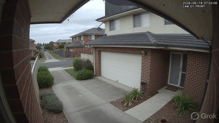

# funes-vision

> *"The solitary and lucid spectator of a multiform, instantaneous, and almost
> intolerably precise world."*
> — Jorge Luis Borges, *Funes the Memorious*

A local-first, two-stage computer vision sentry for camera motion stills. It runs
on a 4-core ARM box with **zero required cloud dependencies** and turns Hikvision
FTP snapshots into a queryable, de-duplicated timeline of visits.

> **Repo rename:** this is now **funes-vision** (formerly "webcam"). The systemd
> units and some paths still use `webcam` — intentional, not a bug.

**How it works:** cameras drop motion stills over FTP; `inotifywait` queues each
one. A cheap YOLOv4-tiny pass runs on every frame; only real hits reach a local
vision LLM (`gemma4:e2b` via Ollama) that returns a fixed Home Assistant flag
schema (`postal_delivery`, `porch_access`, `animal_detected`, ...). Contiguous
detections group into **visits** — see [ARCHITECTURE.md](ARCHITECTURE.md).

## Quickstart

**Prerequisites:** Linux/systemd (Debian/Ubuntu), Python 3.11+, `inotify-tools`,
`jq`, `ffmpeg`, and Docker Compose. Ollama is optional (deep pass only). Full
detail: [docs/INSTALL.md](docs/INSTALL.md).

```bash
# 1. Clone
git clone https://github.com/matthewhand/funes-vision.git
cd funes-vision
# 2. Python dependencies (a venv is recommended)
python3 -m venv .venv && . .venv/bin/activate
pip install -r requirements.txt
# 3. Configure — watched dirs, YOLO weights, model, TZ
cp settings.example.json settings.json   # then edit watch_dirs / yolo_dir / timezone
# download yolov4-tiny.cfg + yolov4-tiny.weights into yolo_dir (see docs/INSTALL.md)
# 4. Install and start the pipeline services (Linux/systemd)
sudo bash systemd/install.sh
# 5. Serve the gallery (nginx, read-only mounts)
docker compose up -d
```

Open the gallery at **http://localhost:8180/**.
`docker-compose.yml` publishes `127.0.0.1:8180` (loopback only). Before exposing
it to your LAN, bind it yourself and put authentication in front of it (the API
and nginx support optional basic auth).

## Project status

**Built and working:** event-driven ingest; tiered YOLO + local-LLM detection
writing Home Assistant flags; visit timeline with flipbook playback and GIF
export; pin/delete with pin-aware retention (per-camera byte budget + age); cron
watchdog; `/api/status`, `/api/health`, and an SSE `/api/events` stream; Slack
and optional HA-MQTT integrations; a stdlib-only test harness. Installable via a
web app manifest + iOS "Add to Home Screen" — **no service worker yet**.

**In progress:** per-image LLM token streaming and a full push pipeline (the SSE
stream already rides the pipeline's append-only `events.jsonl` bus and keeps
catalog-mtime diffing as a fallback). See [ROADMAP.md](ROADMAP.md) and
[docs/USER-GUIDE.md](docs/USER-GUIDE.md).


*Screenshot from the synthetic fixture gallery — never real camera footage.*

### See it in action



The flipbook and visit-player animations are generated from the synthetic
fixture gallery (never real footage) by `tools/screenshots/make_gifs.py`;
larger clips live in [docs/guide/img](docs/guide/img) and
[docs/USER-GUIDE.md](docs/USER-GUIDE.md).

## Why not Frigate / Agent DVR?

| | funes-vision | Frigate | Agent DVR |
|---|---|---|---|
| Focus | Post-hoc timeline of stills + HA flags | Live/recorded video NVR | Live/recorded video NVR |
| Video pipeline | No — motion stills over FTP | Continuous stream + detection | Continuous stream + detection |
| AI | Tiered YOLO + local vision LLM (Ollama) | Coral/GPU detector, no LLM schema | Detector + optional cloud AI |
| Home Assistant | Fixed flag schema, first-class | MQTT entities | MQTT / HTTP |
| Required cloud | None | None | Optional cloud |
| Best for | "Who was here, confirmed" on a small ARM box | Live NVR with clips | Live NVR, many cameras |

A focused two-camera homelab project, not an enterprise VMS. New integrations are
welcome via [CONTRIBUTING.md](CONTRIBUTING.md).

## Docs & community

- **[docs/USER-GUIDE.md](docs/USER-GUIDE.md)** — how to use the gallery
- **[docs/INSTALL.md](docs/INSTALL.md)** — full install (systemd, YOLO, Ollama)
- **[DEPLOYMENT.md](DEPLOYMENT.md)** — how *this* host runs it (units, ports, cron)
- **[docs/ARCHITECTURE.md](docs/ARCHITECTURE.md)** · **[docs/diagrams/](docs/diagrams/README.md)** — 16 self-contained HTML/SVG diagrams (architecture, `index.html` internals, test gates, deployment, sequences, data model)
- **[ARCHITECTURE.md](ARCHITECTURE.md)** · **[API.md](API.md)** · **[DEVELOP.md](DEVELOP.md)** · **[ROADMAP.md](ROADMAP.md)**
- **[CONTRIBUTING.md](CONTRIBUTING.md)** (dev setup, tests, PRs) · **[SECURITY.md](SECURITY.md)** · **[CHANGELOG.md](CHANGELOG.md)**
- **[LICENSE](LICENSE)** (MIT) · **[THIRD_PARTY_NOTICES.md](THIRD_PARTY_NOTICES.md)**
