# Webcam gallery — how to use it

A two-camera, local-first gallery. Motion stills land on this box. A fast
detector tags **who or what**. A local vision model (`gemma4:e2b`) adds
**scene flags** (delivery, porch, dog in the yard). Nothing is uploaded
unless you turn an integration on.

Read this top to bottom the first time. It follows the chrome you will
see after you open the front camera.

A rendered copy with the pictures inline lives at
[`USER-GUIDE.html`](USER-GUIDE.html) (open that file in a browser).

---

## How to read this guide (please do)

Every picture here is from a **synthetic fixture gallery** — fictional
CCTV stills, not your house. The screenshot harness **refuses**
`/mnt/models/Webcam21` and `/mnt/models/Webcam22`.

**The fixture shots over-promise captions.** You will see sentences such
as *“A tan dog in the backyard near the garden bed.”* Those strings are
baked into the fixture catalog so the screenshots look like a product.
The live e2b pass **does not write free-text captions**. On your cameras
you should expect:

- detector badges (`Person`, `Dog`, `Car`, `Bird`, `Cat`)
- quieter scene flags (`Postal delivery`, `Porch access`, `Animal type: dog`)
- at most **two synthesized facts** on a Timeline card, such as
  *“Postal delivery on foot. Someone at the porch.”*
- **no sentence at all** on a detector-only visit (parked car, or a
  person the vision model has not finished)

**The fixture catalog mixes both cameras** so one walkthrough can show a
dog visit *and* a postal visit. Live, both cameras are served from **one**
nginx container: the front feed at the root and the dogcam feed under
`/Webcam22/` — they share one URL, and the header still first-paints
**Webcam Live Feed** (front). The two cameras are also reachable on their
own subdomains behind basic-auth (`webcam.` / `dogcam.…`), which proxy
`/api/` to the write API.

The on-still OSD clock is stamped to match the filename date
(**18 June 2026**). The header, tabs, Settings labels, Live badge, and
Front/Back camera names in the shots **do** match the live UI.

---

## This box, today

These knobs are what the running pipeline is set to. Do not assume a
fresh clone behaves the same if `settings.json` is missing.

| Knob | This box |
|------|----------|
| Front camera | `http://<host>:8180` — header **Webcam Live Feed** |
| Back camera | the same URL, under `/Webcam22/` — header **Dogcam Live Feed** |
| Vision model | `gemma4:e2b` via local Ollama (~40 s/frame when busy) |
| Cloud fallback | **off** |
| Vision deep passes | **on** (person/dog/cat/bird jump the queue) |
| Idle backfill | **off** (empties and parked-car frames are not HA-flagged) |
| Multi-image summaries | **off** |
| Quiet label | `car` (does not spend urgent LLM budget) |
| Disk budget | **5 GB per camera** |
| Empty-frame age | **30 days** |
| Camera offline | **24 hours** without a new still |
| Timezone | `Australia/Sydney` (subtitle shows `AEST` / `AEDT`) |
| Slack | **on**, `notify_mode: context` — silent while summaries are off. Switch to **objects** to ping person/dog/cat/bird |
| HA MQTT | **on** this box (explicit broker in `integrations.json`). Flags only, not JPEGs |

---

## 1. Open it

| Camera | Address |
|--------|---------|
| Front (driveway / gate) | `http://<host>:8180` |
| Back (yard / dogcam) | the same URL, under `/Webcam22/` |

Each camera is its **own site** — they do not share one URL or one
filter state. Switch feeds with the **Switch to Dogcam Feed** link in the
header, or open `/Webcam22/` directly.

On a phone, **Add to Home Screen**. There is no service worker, so you
will not get a stale offline copy.

The header title is **Webcam Live Feed** (front) or **Dogcam Live Feed**
(back). The subtitle is *Monitoring front gate area · AEST* or
*Monitoring backyard and dog area · AEST* — **not** a LAN address.
Filenames on disk still contain camera IPs; the chrome is not supposed
to show them. Status calls the same two cameras **Front** and **Back**.

**Switch Feed** in the header jumps to the other camera
(*Switch to Dogcam Feed* / *Switch to Webcam Feed*).

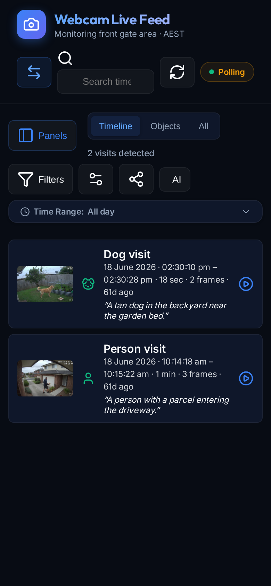

On a phone you will also see a **Panels** button. That hides or shows
the date list, activity charts, and saved searches. Landscape desktop
keeps the sidebar open.

---

## 2. The header

Left to right:

- **Camera name + timezone**
- **Switch Feed** — other camera
- **Search** — time, detector labels, or caption text (see [§5](#5-find-something))
- **Refresh** — force-reload catalogs from disk
- **Live** — a switch, not just a light (see [§9](#9-live-updates))

On the toolbar (next to Settings / Integrations / **AI**):

- **Help** — this walkthrough, in a new tab (fixture pictures, not your house)

Default first paint is a green **Live** pill. Click it to pause. The
visible states are:

| Badge | Meaning |
|-------|---------|
| **Live** | Event stream connected, heartbeats arriving |
| **Stale** | Stream still open, but the heartbeat went quiet |
| **Polling** | Asking the server on an interval (SSE down or unsupported) |
| **Auto-refresh: OFF** | You flipped the switch; stream and polls are stopped |

---

## 3. Three views

The default tab is **Timeline**.

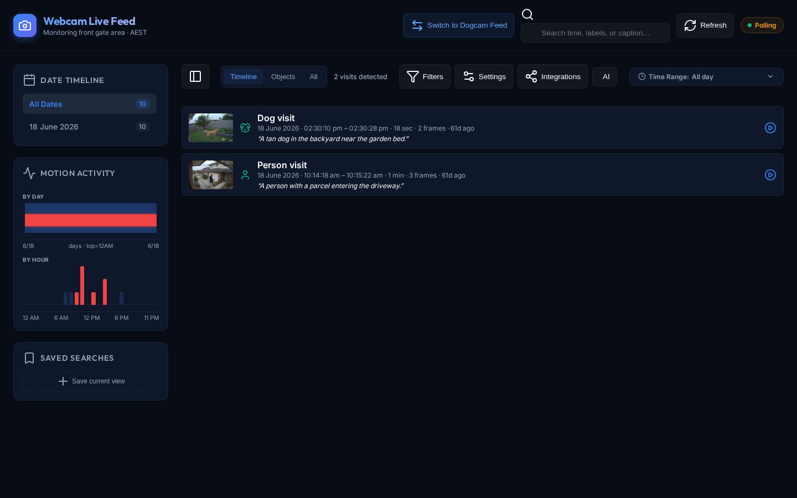

| Tab | What it is |
|-----|------------|
| **Timeline** | Object *visits* — a run of stills grouped into one card you can play |
| **Objects** | Only frames the detector marked (person / dog / car / …) |
| **All** | Every motion still, including empty / **CLEAR** frames |

The count next to the tabs is honest about the current tab
(*“2 visits detected”* vs *“Showing 7 of 10 snapshots”*). Timeline
caps the list at 300 visits (*“showing first 300 of N visits”*).

Grid density buttons (small / medium / large / list) appear on
**Objects** and **All** only. Timeline ignores them, so they hide there.

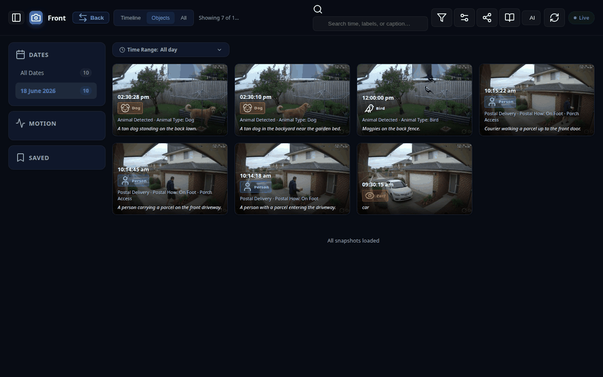

**All** is where empty driveway stills live. They are labelled **CLEAR**,
not “nothing happened.”

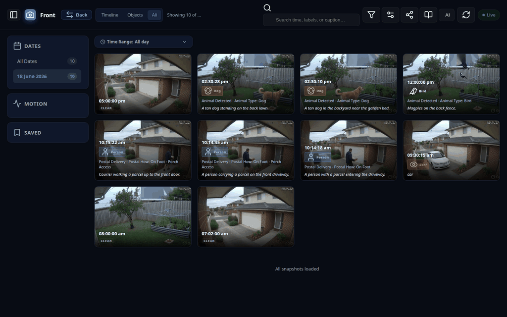

On a phone, **All** is a single-column stack:

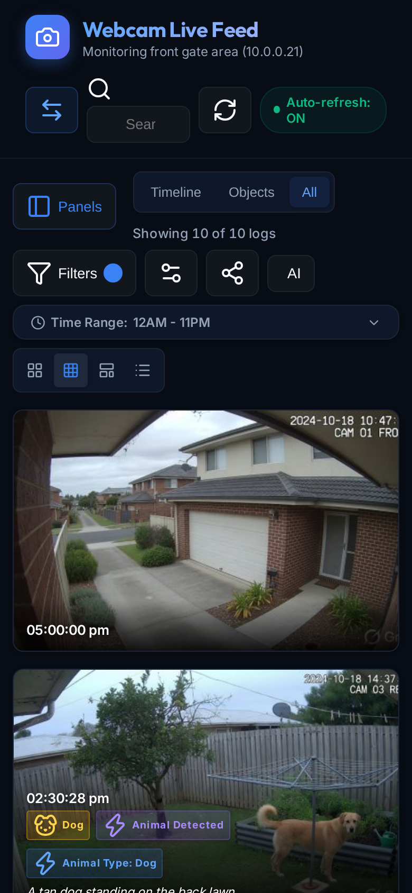

---

## 4. The left rail

### Date Timeline

**Today** is the default (the civil date in `Australia/Sydney`). **All
Dates** is still on the rail if you want the whole archive. If today
has no stills yet, the newest day in the catalog is selected instead.
The count is how many stills that day has, not how many match the
current object filter. Clear all returns to this home day.

### Motion Activity

- **By day** — one bar per day, top = midnight. Red marks when the
  *currently filtered* objects appeared.
- **By hour** — 12 AM → 11 PM over the selected day(s).

Tap a day bar to drill into hours. Tap again to clear. Search and object
filters apply to these charts the same way they apply to the grid. Typing
`person` hides empty hours on the chart, not just the cards.

### Saved Searches

**Save current view** stores the current tab + object chips + search +
date + time range **in this browser only** (`localStorage`). It does not
sync to the other camera site or another phone. Chips recall that
snapshot; they do not change Settings.

---

## 5. Find something

### Filters

**Filters** lists detector objects the archive has actually seen
(`Person`, `Dog`, `Car`, `Bird`…). Scene flags are **not** chips.

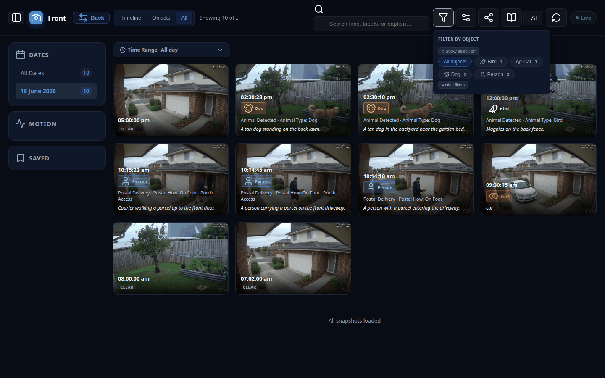

- **All objects** clears object chips. It does not reset the date or
  time range (the banner **✕** / **Clear all filters** does).
- **Sticky select** — on: tap several chips (match any). Off: one at a
  time.
- Hidden labels (Settings → Hide / Show) never appear here. Unhide them
  in Settings; Clear all will not unhide them.

On a phone the Filters menu is a centred sheet, same as Settings.

### Search

Placeholder: *Search time, labels, or caption…* on a wide screen.
On a phone the same field says *Search…* so it is not clipped.

Matches, case-insensitive, against:

- human date / time (`18 Jun 2026`, `10:14`)
- detector labels (`person`, `dog`, `car`)
- event type / filename tokens
- caption text (fixture sentences **or** synthesized HA facts)

The grid, Timeline, and activity charts share this predicate. If you
type `person` and a card disappears, the red chart bars for that hour
disappear too.

### Time range

The toolbar row starts collapsed as **Time Range: All day**. Expand it
for a dual-range slider.

On a phone you also get pills:

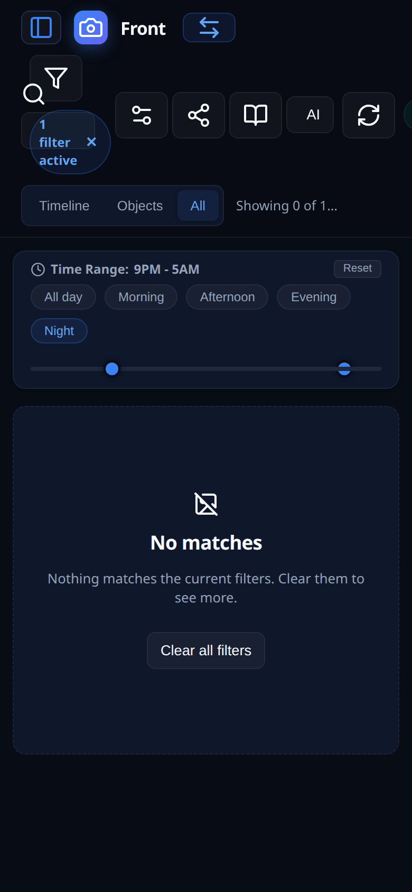

This fixture day has no stills between 21:00 and 05:00, so Night
honestly reads **No matches**. The 5 pm empty is **Evening**, not Night.

| Pill | Hours |
|------|-------|
| All day | 00–23 |
| Morning | 06–11 |
| Afternoon | 12–16 |
| Evening | 17–20 |
| **Night** | **21–05** (wraps midnight) |

Night is the porch-camera window. Use the **Night** pill, not the
slider, to set it. The thumbs will look inverted (21 and 5); that is
cosmetic. Dragging the slider yourself drops the wrap and becomes a
normal start≤end range.

**Reset** on the time row, or **Clear all filters**, returns All day and
syncs the pills.

A green **N new events — tap to view** pill (see [§9](#9-live-updates))
also clears search, object chips, date, and time, then scrolls to top.

---

## 6. Read a card

Colour badges are **detector objects**: person, dog, car, cat, bird.

Smaller purple-ish flags are **scene flags** (e2b, or the porch-zone
mask). They describe *what happened*. They are not extra species, and
they do not appear in Filters.

e2b is asked **one question at a time**, and only when YOLO says the
frame is worth it (at most two questions per still):

| Scan | Camera | Only if YOLO saw | Why |
|------|--------|------------------|-----|
| postal delivery | Front | person | Courier only — suitcase/resident is false |
| dog walked | Both | person **and** dog | Asked before porch when both are present |
| porch access | Front | person centre on the tiles | **Not an e2b question.** A porch-zone polygon (Settings → Gate porch by tiles) sets the flag from YOLO geometry. Path / driveway / street is false. |
| opens a box | Front | person | Second slot, now that porch no longer spends a scan |

**Animal** is not an e2b question. If YOLO saw dog/cat/bird we copy that
through (`animal_detected` + type). e2b was missing real yard dogs and
inventing animals on person-only frames.

We **do not ask** `approaching_house`, `car_access`, `clothes_drying`,
`leaving_house`, `enters_car` / `exits_car`, car colour/outfit, or
`weapon_detected`. Those were systematic false positives (parked SUV,
empty yard, unattended laundry). A backyard person with no dog spends
**zero** e2b time.

| You see | It means |
|---------|----------|
| `Person` / `Dog` / `Car` | YOLO saw that object |
| `Car?` (amber) | Detector hit; no successful `_llm` merge yet (includes parked-car skips) |
| Struck-through badge | Leftover “disputed” UI (one pass said yes, the other did not). Hidden unless **Show unconfirmed detections** is on. The current e2b schema does **not** overwrite YOLO `person`/`dog`/`car`, so this is rare |
| `Postal delivery` / `Porch access` / `Animal type: dog` | HA flags from a finished vision pass |
| **CLEAR** | Analyzed, no object |
| No badge, no CLEAR | Not in `analysis.json` yet |

Captions on your live cameras:

- If the catalog has a `description` (it will not, from e2b), that
  sentence is used.
- Otherwise the gallery invents at most two facts from true HA flags
  (*“Postal delivery on foot”*, *“Dog in the yard”*, *“Clothes on the
  line”*).
- Detector-only cards often have **no** caption.

The pin **button** (not an emoji) protects that file from retention
forever. Delete asks
`Delete person snapshot from 18 Jun 2026 · 10:14:18 am?` — date and
label, never the FTP filename.

---

## 7. Play a visit

Tap a Timeline card or its play button.

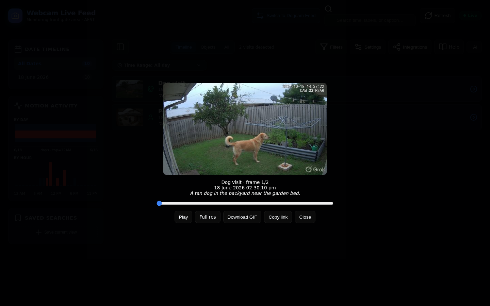

You get:

- Play / pause (it autoplays unless the OS asks for reduced motion;
  the button then reads **Pause**)
- A scrub slider
- Tap the image to step frame-by-frame
- Arrows, Space, Esc
- **Full res**
- **Download GIF** — only when the visit has **more than one** frame
  (needs the write API)
- **Copy link** to this moment (deep link; this browser must have the
  same catalogs loaded)
- **Close**

There is **no pin** in the visit player. Pin from the Objects/All card.

The flipbook stays on **the same camera** and will not pull in a still
from more than five minutes earlier as “lead-in.” A dog visit will not
open on a courier from the other camera.

---

## 8. Lightbox (single frame)

From Objects or All, tap a still.

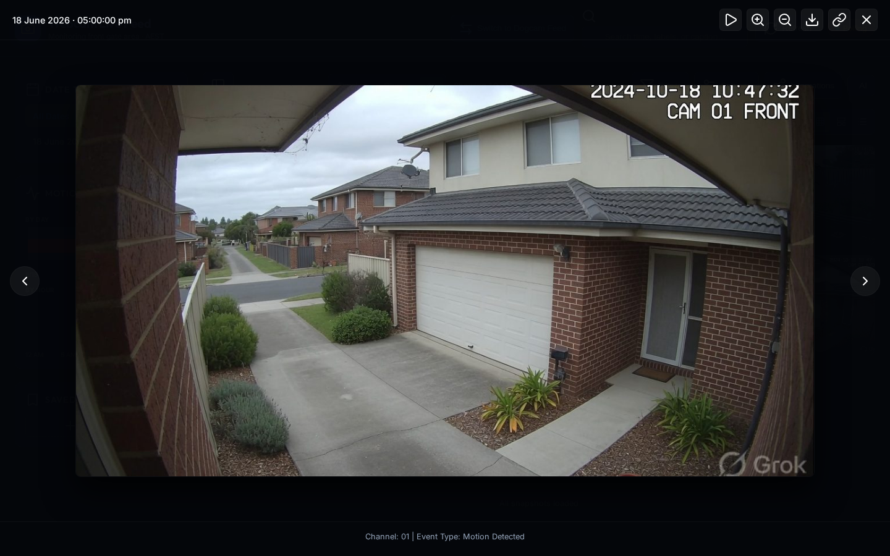

- Heading is the human date/time, not the FTP name
- Play is a slideshow through the **current filtered** set
- Zoom +/−, download, copy link, close
- Footer: channel / event type / detected objects (labelled
  **Detected:**, not “AI DETECTED”)
- On a phone: swipe to next/prev (one finger, not zoomed), pinch to
  zoom, drag to pan when zoomed

Delete from a card (not the lightbox header) is permanent.

---

## 9. Live updates

New stills appear without a full-page reload. The pipeline appends a
line to `events.jsonl` **as each frame is persisted** (YOLO does not
wait for the 40 s vision pass, and the catalog is no longer held until
the end of the sweep). The API tails that log about once a second
(and still watches file mtimes as a fallback):

| Event | What you notice |
|-------|-----------------|
| `image.new` | A new still lands (often still empty) |
| `detection.preliminary` | Detector hit, including parked-car `Car?` |
| `new-detection` | A successful vision merge with a detector label |
| `new-burst` | A visit summary was written (rare: summaries are **off**) |
| `ping` | Heartbeat; missing pings turn the badge **Stale** |

A floating **N new events — tap to view** pill accumulates while you
are looking at an old slice. Tap it to clear filters and jump to the
newest frames.

Flip **Live** off and both the stream and the polls stop. The page
will not quietly keep listening.

---

## 10. The AI button (pipeline status)

The **AI** control is pipeline status, not a chat. It pulses amber
with an elapsed time while a frame is in the vision model.

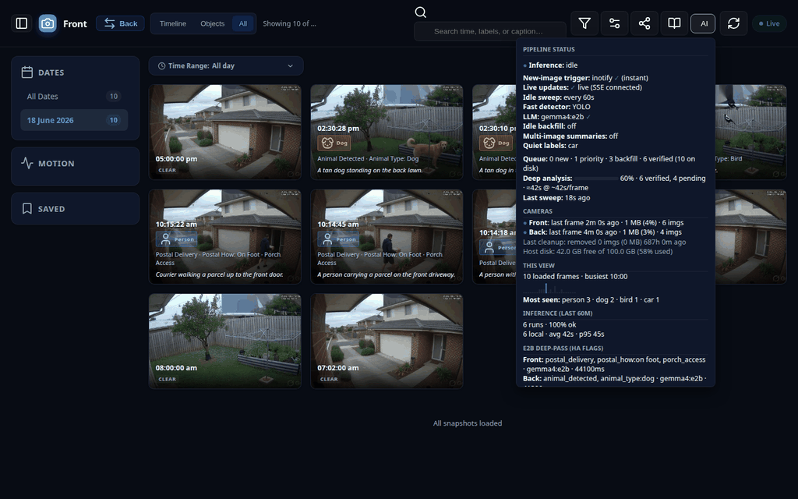

On a phone the same panel is a centred sheet that scrolls:

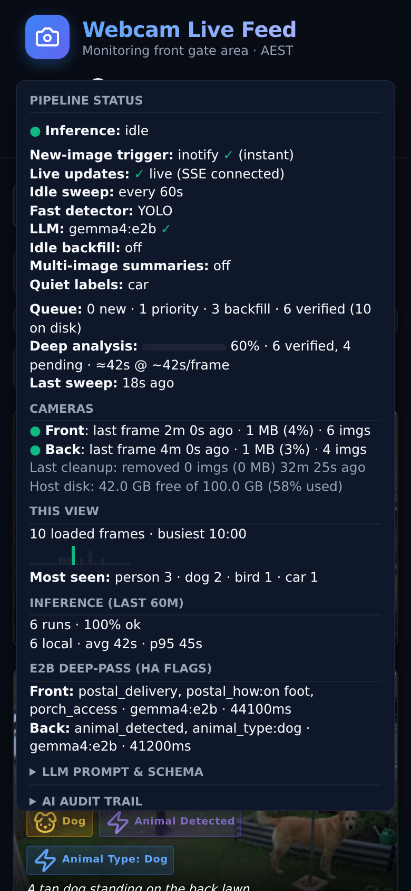

**LLM Prompt & Schema** and **AI Audit Trail** start collapsed — expand
them if you want the raw prompt. The panel itself scrolls when the
list is taller than the window.

You should see, in order:

- **Inference:** idle — or **Analyzing now:** with the human date/time of
  the frame (not the FTP name), model, trigger, and elapsed time
- **New-image trigger:** inotify ✓ (instant). Red *not running!* if the
  watcher is down
- **Live updates:** `live (SSE connected)` / `polling (stream offline)` /
  `stale (no signal)` — longer wording than the header badge
- **Idle sweep:** every 60s on this box
- **Fast detector:** YOLO
- **LLM:** `gemma4:e2b` plus a reachability tick. `(+cloud)` only if
  `allow_cloud` is on — there is no “local only” label
- **Idle backfill** / **Multi-image summaries** — both **off** here
- **Quiet labels:** car
- **Queue:** `N new · N priority · N backfill · N verified (N on disk)`.
  Verified means a **non-empty** `_llm` dict
- **Deep analysis:** a percent bar over verified vs pending, plus an
  ETA (`≈42s @ ~42s/frame`) when priority work is queued
- **Last sweep:** age, or red *stalled?* if older than 30 minutes
- **Cameras:** **Front** and **Back** (header says Webcam / Dogcam)
- Last cleanup / host disk, when the API has those numbers
- **This view:** stats over *loaded* frames (busiest hour, sparkline,
  most-seen). Not a product called Insights
- **Inference (last 60m):** run counts; cloud counts hidden unless cloud
  is on
- **E2B Deep-Pass (HA Flags):** latest front/back flag snapshot
- **Audit trail:** recent vision calls, titled with date/time

---

## 11. Settings

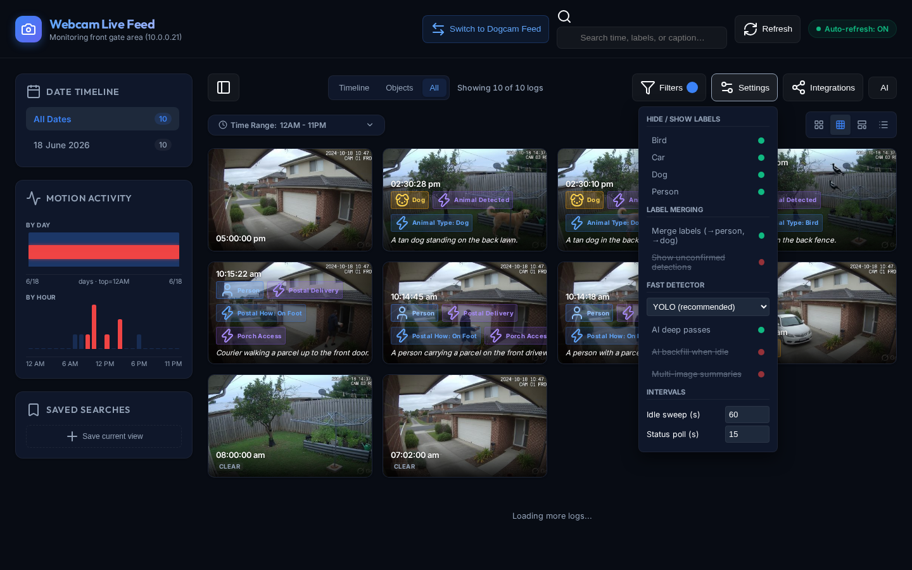

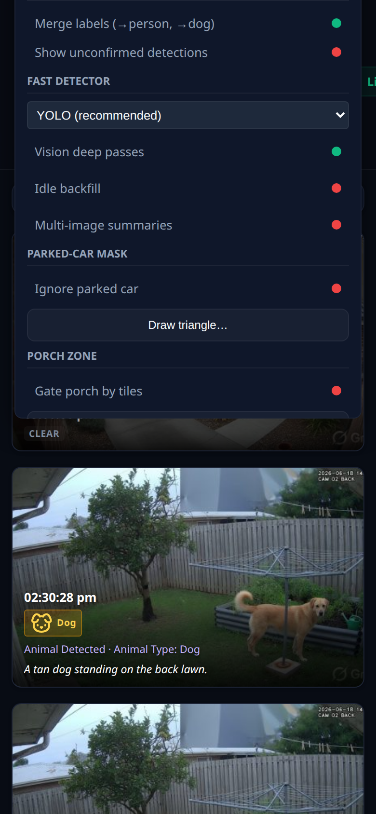

Green = on, red = off (the dot). Off rows are **not** struck through —
strikethrough is only for a hidden object label (person/dog/…) under
**Hide / Show labels**. First paint matches this box: deep passes on,
idle backfill off, multi-image summaries off.

| Control | What it actually does |
|---------|------------------------|
| **Hide / Show labels** | Drops that object from Timeline / Objects / Filters. A parked car you are tired of. **Unhide** is the escape; Clear all does not unhide |
| **Merge labels** | `face`/`body` → person, `raccoon` → dog |
| **Show unconfirmed detections** | Reveals struck-through disputed badges. Preliminary `?` badges always show |
| **Fast detector** | YOLO (keep this) or Haar (legacy) |
| **Vision deep passes** | Master switch for **all** vision-model work. Off = detector-only, frees RAM |
| **Idle backfill** | When idle, verify leftover empties **and** car-only skips, nearest a real detection first. Leave **off** unless you want thousands of old empties queued. It is **not** “every image, newest first” |
| **Multi-image summaries** | LLM caption of a visit from several frames. Off because e2b 400s on that path. Single-frame flags are unchanged |
| **Idle sweep (s)** | Server: seconds between catch-up sweeps |
| **Status poll (s)** | This browser only: how often the AI panel refreshes |
| **Ignore parked car** | Front camera: a triangle over the orange SUV bay. YOLO **drops** a `car` whose centre sits in that triangle (the parked car that is in almost every still). A car on the street, or the orange car **leaving** onto the street, sits outside the triangle and is kept. **Draw triangle…** to retarget. Applies to **new** stills, not the archive |

---

## 12. Integrations

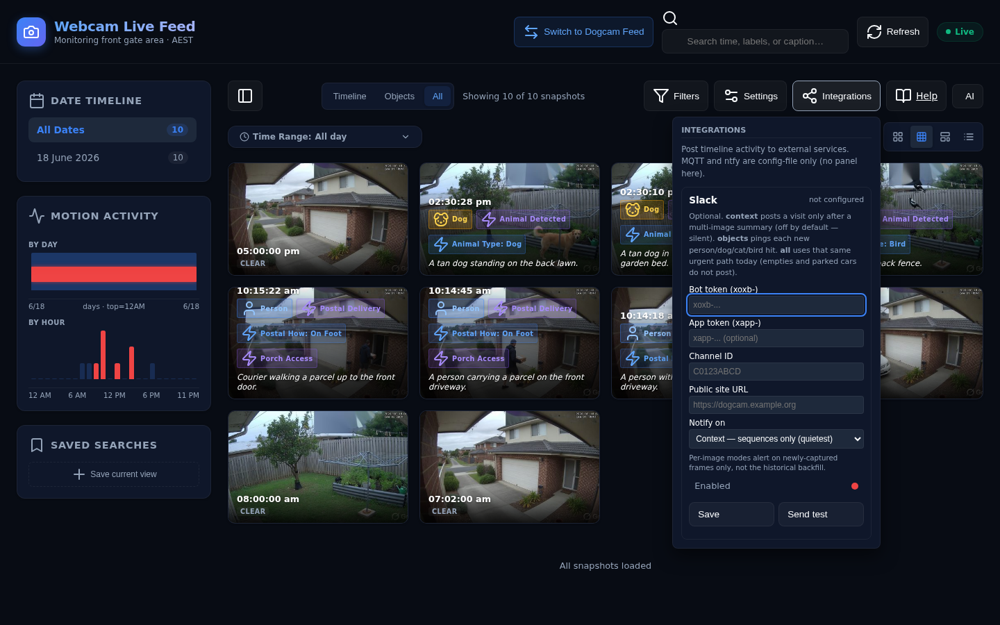

**Integrations** is Slack in the UI. MQTT and ntfy are config-file
only (no panel).

### Slack

| Notify on | When it posts |
|-----------|----------------|
| **Context — sequences only** | Only after a multi-image summary. Summaries are **off**, so this mode is **silent**. That is intentional |
| **Object detections** | Each **new** person/dog/cat/bird hit. The vision model does **not** have to finish. Not parked cars. Not idle backfill |
| **All** | Same urgent path as objects today. Empties and parked cars do **not** post |

Tokens stay on the box (`integrations.json`, mode `600`, never copied
to the web root). Leave a token field blank to keep the stored secret.

**Save** with a corrupt secrets file is refused (**409**). The status
line will read *integrations.json unreadable — save refused*. MQTT/ntfy
blocks are not wiped. **Send test** talks to Slack for real.

### Home Assistant MQTT

Product default is **off** until you set `enabled` and an **explicit
broker host** (no `10.0.0.111` default). **This box has it on.** It
publishes retained **flags**, not JPEGs, and only after a successful
non-empty `_llm` merge.

### ntfy

Config-file only. Needs both a topic **and** an explicit `server_url`.
There is no public `ntfy.sh` default.

---

## 13. What the box does without you

- New motion stills are picked up within seconds (`inotify`)
- Person / dog / cat / bird jump the queue for e2b flags (~40 s each
  when the box is busy)
- Parked-car-only frames are stored as `Car?` and do **not** spend
  urgent LLM budget
- The **porch zone** (grey tiles, right of the front still) is a
  geometry gate like the parked-car triangle. People on the brick path
  or street do not count as porch, and e2b is not asked that question.
- Empty frames older than **30 days** are removed
- Each camera has a **5 GB** image budget; oldest empties go first,
  then oldest detections, then oldest unanalyzed if still over
- **Pins are forever**
- A cron watchdog restarts a stuck pipeline and re-runs retention
  hourly, so cleanup does not depend on one long-lived process

---

## 14. Privacy

Frames and inference stay on this machine by default.

Things that *can* leave, only if you turn them on:

- Slack messages (and uploaded clips, if configured)
- ntfy text (only with an explicit server URL)
- Home Assistant MQTT flag JSON (no image bytes; needs an explicit host)

This guide’s screenshots are generated fiction. They are not your house.

---

## 15. If it looks wrong

| Symptom | Likely cause |
|---------|----------------|
| Empty Objects tab | No detector hits in the current day / filter / search |
| Empty Timeline, “labels are hidden” | You hid `person` (etc.) in Settings. **Unhide**, not Clear all |
| One camera looks stale | No new stills for 24 hours, or the FTP drop stopped |
| Images vanished | 5 GB budget or 30-day empty-frame rule. Pins survive |
| Pin / delete / settings / GIF do nothing | Write API (`webcam-api` on `:8190`) is down |
| “AI is looking…” never finishes | Ollama not loaded, or free RAM below ~6 GB |
| Slack never pings | Mode is **context** and summaries are off. The card says **enabled but silent** — switch to **objects** (person/dog/cat/bird, not car) |
| Slack save says unreadable | `integrations.json` is corrupt. Do not keep hitting Save |
| Live is Polling / Stale | SSE dropped. Refresh, or the API is down |
| Night slider looks broken | Use the **Night** pill. Do not drag the thumbs to wrap |
| Caption missing on a visit | e2b does not write sentences, but a YOLO-only visit still gets one ("person", "car") from the detector labels. A visit with no detection at all (empty/CLEAR) has none — that is correct |
| Status says Front / Back | Correct. Those are the two cameras |
| Charts do not move when you search | They should. If they do not, refresh — that was a fixed bug |

---

## For operators

Developer / ops reference: [DEVELOP.md](../DEVELOP.md),
[DEPLOYMENT.md](../DEPLOYMENT.md), [API.md](../API.md).
How the screenshots were taken: [tools/screenshots/README.md](../tools/screenshots/README.md).
What is still not built (token streaming, pipeline→API push):
[ROADMAP.md](../ROADMAP.md).
